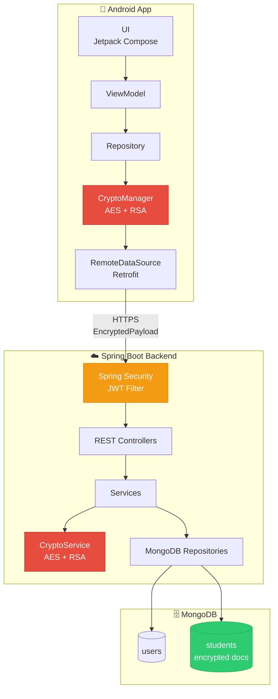
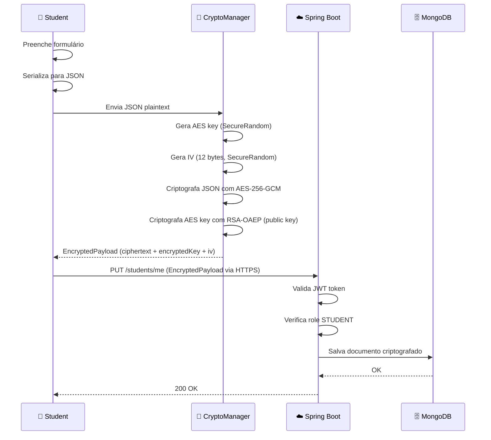
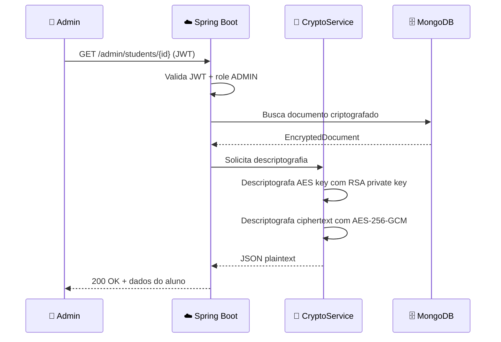
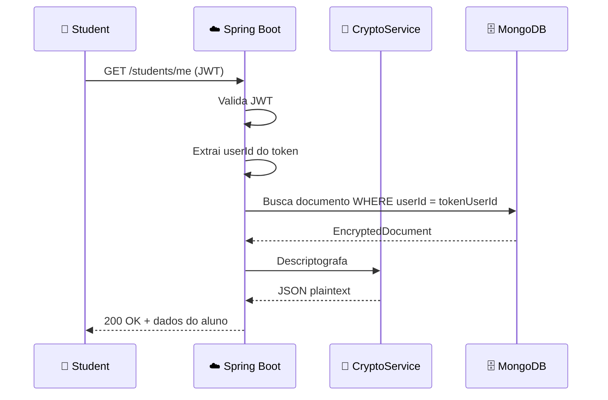
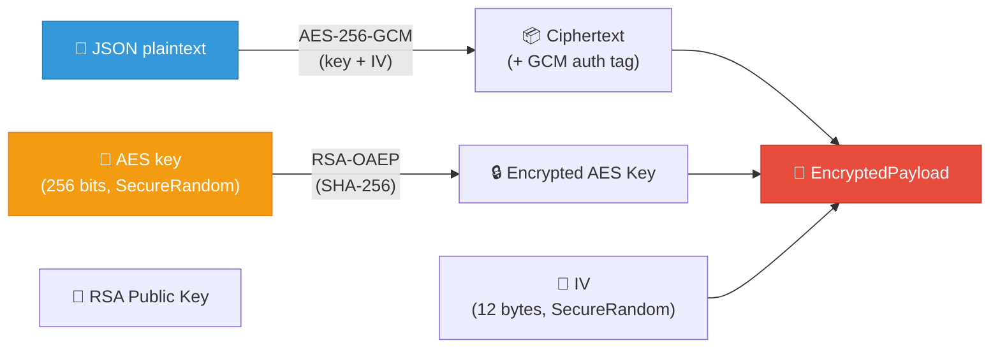
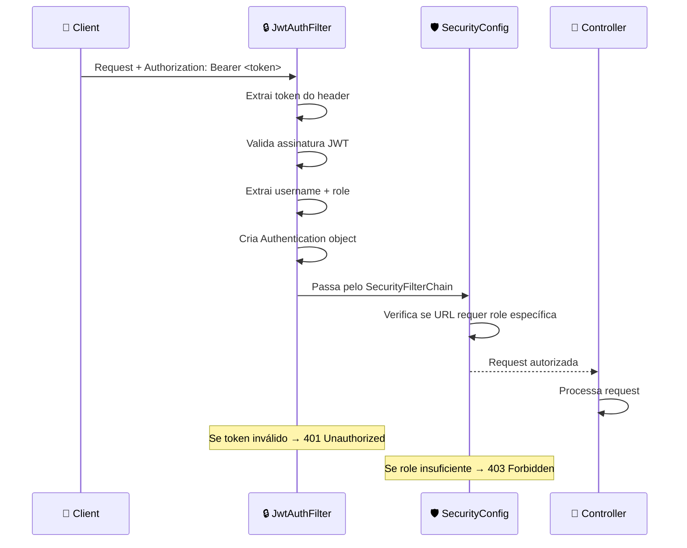
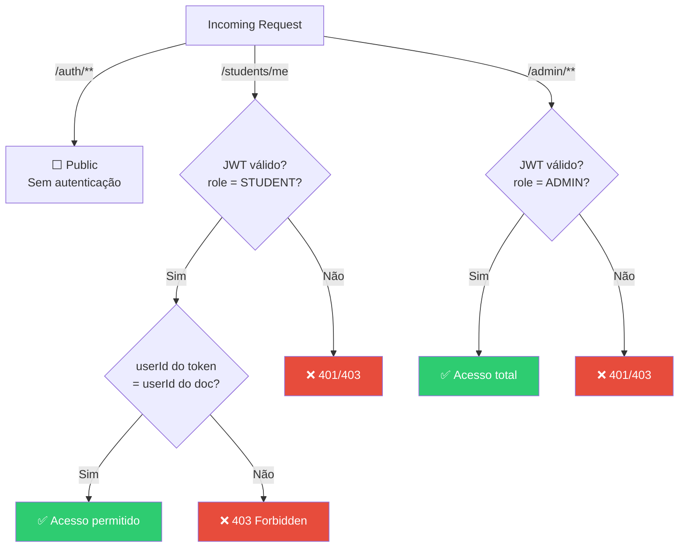
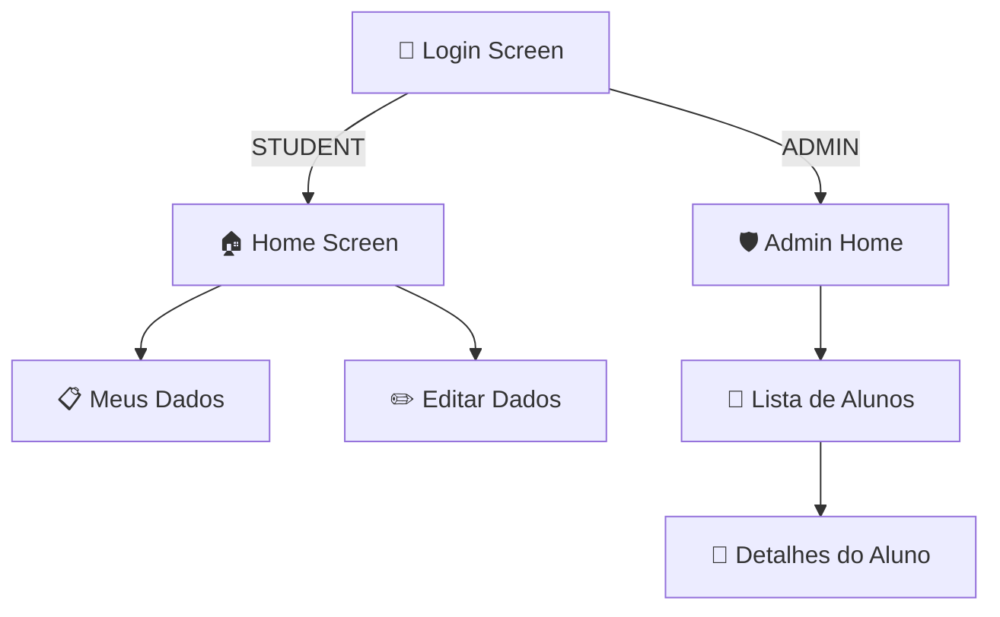
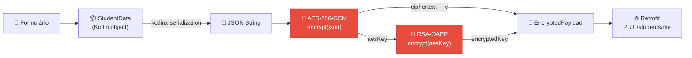
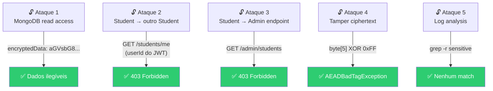

# Plano de Implementação — EduVault

> **"Um aplicativo Android pode criptografar dados sensíveis antes do envio, armazená-los criptografados em um banco de documentos e permitir que somente usuários autorizados recuperem os dados originais."**

---

## 1. Visão Geral

EduVault é uma **Proof of Concept (PoC)** educacional que demonstra proteção e criptografia de dados sensíveis em uma aplicação mobile. O sistema simula um cenário de dados escolares onde um aluno (`STUDENT`) preenche informações pessoais fictícias no Android, que são **criptografadas no dispositivo** antes de serem transmitidas ao backend Spring Boot, armazenadas de forma criptografada no MongoDB e recuperadas apenas por usuários autorizados.

### Filosofia

```
LEARN BY BUILDING
```

Cada fase ensina um conceito, implementa uma funcionalidade, testa e avança. Sem blocos gigantes de código — incrementos pequenos e compreensíveis.

---

## 2. Objetivos

| # | Objetivo | Tipo |
|---|----------|------|
| 1 | Usuário preenche dados no Android | Funcional |
| 2 | Android transforma dados em JSON | Funcional |
| 3 | Android criptografa JSON antes do envio | **Segurança** |
| 4 | Payload criptografado viaja via HTTPS | Segurança |
| 5 | Spring Boot recebe conteúdo criptografado | Funcional |
| 6 | MongoDB armazena documento criptografado | **Segurança** |
| 7 | Banco não possui plaintext sensível | Segurança |
| 8 | Usuário autorizado recupera dados | Funcional |
| 9 | Aluno não vê dados de outro aluno | **Autorização** |
| 10 | Aluno não acessa funções administrativas | Autorização |

### Objetivos Pedagógicos

- Aprender Spring Boot do zero (conceitos incrementais)
- Compreender criptografia aplicada (AES-GCM + RSA-OAEP)
- Praticar segurança em APIs (JWT, roles, authorization)
- Integrar Android nativo com backend REST

---

## 3. Escopo

### 🔴 Dentro do escopo (obrigatório)

- Backend REST com Spring Boot + MongoDB
- Autenticação JWT com roles (STUDENT, ADMIN)
- Criptografia híbrida (AES-256-GCM + RSA-OAEP)
- App Android com login, formulário e visualização
- Demonstração de segurança (acesso negado, tamper detection)

### 🔴 Fora do escopo

- OAuth2 / OpenID Connect
- Microserviços / CQRS / Event Sourcing
- Kafka, Redis, Kubernetes
- Flutter / React Native
- PostgreSQL / MySQL / JPA / Hibernate
- Cadastro de usuários via app (users serão seed)
- Notificações, chat, dashboard sofisticado

---

## 4. Arquitetura



### Responsabilidades de cada componente

| Componente | Responsabilidade |
|------------|------------------|
| **UI (Compose)** | Telas de login, formulário e listagem |
| **ViewModel** | Estado da UI, orquestra chamadas ao Repository |
| **Repository** | Abstração entre ViewModel e dados remotos |
| **CryptoManager** | Criptografa JSON com AES-GCM, protege chave AES com RSA-OAEP |
| **RemoteDataSource** | Chamadas HTTP via Retrofit |
| **REST Controllers** | Endpoints HTTP, validação de entrada |
| **Spring Security** | Autenticação JWT, autorização por roles |
| **Services** | Lógica de negócio, orquestra crypto e persistência |
| **CryptoService** | Descriptografa dados (RSA → AES key → plaintext) |
| **MongoDB Repositories** | Persistência de documentos |
| **users collection** | Credenciais e roles |
| **students collection** | Dados criptografados dos alunos |

---

## 5. Stack

### Backend

| Tecnologia | Versão | Propósito |
|------------|--------|-----------|
| Java | 21 | Linguagem principal |
| Spring Boot | 3.3.x | Framework web |
| Maven | 3.9+ | Build tool |
| Spring Web | — | REST API |
| Spring Data MongoDB | — | Persistência |
| Spring Security | — | Autenticação/Autorização |
| jjwt (io.jsonwebtoken) | 0.12.x | Geração/Validação JWT |
| Bean Validation | — | Validação de DTOs |
| JUnit 5 | — | Testes unitários |
| Mockito | — | Mocks em testes |

### Banco de Dados

| Tecnologia | Versão | Propósito |
|------------|--------|-----------|
| MongoDB | 7.x | Banco de documentos |
| Docker Compose | — | Executar MongoDB localmente |

### Mobile

| Tecnologia | Propósito |
|------------|-----------|
| Kotlin | Linguagem principal |
| Jetpack Compose | UI declarativa |
| ViewModel | Gerenciamento de estado |
| Coroutines | Operações assíncronas |
| Retrofit + OkHttp | Cliente HTTP |
| Kotlinx Serialization | Serialização JSON |
| Android Keystore | Proteção de chaves (evolução) |

---

## 6. Fluxo de Dados

### Fluxo de escrita (Student salva dados)



### Fluxo de leitura (Admin consulta aluno)



### Fluxo de leitura (Student consulta próprios dados)



---

## 7. Estratégia Criptográfica

### Por que criptografia híbrida?

A criptografia híbrida combina o melhor de dois mundos:

| Algoritmo | Tipo | Velocidade | Tamanho dos dados | Uso |
|-----------|------|------------|-------------------|-----|
| **AES-256-GCM** | Simétrico | ⚡ Muito rápida | Dados de qualquer tamanho | Criptografar o conteúdo |
| **RSA-OAEP** | Assimétrico | 🐌 Lenta | Limitado (~190 bytes com 2048-bit key) | Criptografar a chave AES |

### Por que AES para o conteúdo?

- **Velocidade**: AES é otimizado em hardware (AES-NI) e software
- **Sem limite prático de tamanho**: pode criptografar megabytes de dados
- **Eficiente**: a mesma operação para 100 bytes ou 100 KB

### Por que RSA NÃO deve criptografar o JSON inteiro?

- RSA-2048 só pode criptografar **no máximo ~190 bytes** por operação (2048/8 - 42 bytes de padding OAEP)
- Nosso JSON de exemplo tem ~200+ bytes — já não caberia
- RSA é **ordens de magnitude mais lento** que AES
- Usar RSA para dados grandes requer chunking, que é complexo e frágil

### Por que GCM (Galois/Counter Mode)?

| Modo | Confidencialidade | Integridade | Autenticação |
|------|-------------------|-------------|--------------|
| CBC | ✅ | ❌ | ❌ |
| CTR | ✅ | ❌ | ❌ |
| **GCM** | ✅ | ✅ | ✅ |

GCM é um modo **AEAD** (Authenticated Encryption with Associated Data):
- **Confidencialidade**: dados ficam ilegíveis sem a chave
- **Integridade**: qualquer alteração no ciphertext é detectada
- **Autenticação**: garante que o ciphertext veio de quem tem a chave

> **PoC**: Se alguém alterar o ciphertext no MongoDB, a descriptografia **falhará** com `AEADBadTagException`. Isso é exatamente o que queremos demonstrar no Ataque 4.

### Importância do IV/Nonce

- O IV (Initialization Vector) no GCM tem **12 bytes (96 bits)**
- Deve ser **único** para cada operação de criptografia com a mesma chave
- **NUNCA** reutilizar IV com a mesma chave — isso quebra completamente a segurança do GCM
- Na PoC: geramos um IV aleatório para cada operação e o armazenamos junto com o ciphertext

### Importância do SecureRandom

- `Math.random()` e `Random` são **previsíveis** — não servem para criptografia
- `SecureRandom` usa fonte de entropia do sistema operacional
- Todas as chaves AES e IVs **devem** ser gerados com `SecureRandom`

### Envelope Criptográfico



O **EncryptedPayload** contém três elementos:

```json
{
  "encryptedData": "Base64(ciphertext + GCM tag)",
  "encryptedKey": "Base64(RSA-OAEP encrypted AES key)",
  "iv": "Base64(12 bytes IV)"
}
```

Para descriptografar:
1. Usa RSA private key para recuperar a AES key
2. Usa AES key + IV para descriptografar o ciphertext via AES-256-GCM
3. GCM verifica integridade automaticamente (tag)

### Descriptografia: Backend vs. Client

| Aspecto | Backend descriptografa | Client descriptografa |
|---------|----------------------|----------------------|
| **Simplicidade** | ✅ Mais simples | ❌ Mais complexo |
| **Gerenciamento de chaves** | ✅ Private key fica no servidor | ❌ Private key teria que ir para o client |
| **Segurança da chave** | ✅ Servidor controlado | ❌ App pode ser reverse-engineered |
| **Isolamento** | ❌ Backend tem acesso ao plaintext | ✅ Dados nunca saem criptografados |
| **Uso na PoC** | ✅ **Escolhido** | ❌ |

> **Decisão**: O **backend descriptografa** os dados quando a operação é autorizada. Isso é mais simples, evita distribuir a private key para clientes e é adequado para a PoC. Em produção, a alternativa de descriptografia no client oferece maior isolamento (zero-knowledge), mas exige gestão complexa de chaves por usuário.

---

## 8. Backend — Detalhamento

### Estrutura do projeto

```
backend/
├── pom.xml
├── docker-compose.yml
├── .gitignore
├── keys/                          ← .gitignore'd
│   ├── rsa_public.pem
│   └── rsa_private.pem
└── src/
    ├── main/
    │   ├── java/com/eduvault/
    │   │   ├── EduVaultApplication.java
    │   │   │
    │   │   ├── auth/
    │   │   │   ├── AuthController.java
    │   │   │   ├── AuthService.java
    │   │   │   ├── LoginRequest.java
    │   │   │   └── LoginResponse.java
    │   │   │
    │   │   ├── student/
    │   │   │   ├── StudentController.java
    │   │   │   ├── StudentService.java
    │   │   │   ├── StudentDocument.java
    │   │   │   ├── StudentRepository.java
    │   │   │   ├── EncryptedPayloadRequest.java
    │   │   │   └── StudentResponse.java
    │   │   │
    │   │   ├── admin/
    │   │   │   ├── AdminController.java
    │   │   │   └── AdminService.java
    │   │   │
    │   │   ├── user/
    │   │   │   ├── UserDocument.java
    │   │   │   ├── UserRepository.java
    │   │   │   └── Role.java
    │   │   │
    │   │   ├── crypto/
    │   │   │   ├── CryptoService.java
    │   │   │   └── CryptoConfig.java
    │   │   │
    │   │   ├── security/
    │   │   │   ├── SecurityConfig.java
    │   │   │   ├── JwtService.java
    │   │   │   ├── JwtAuthenticationFilter.java
    │   │   │   └── CustomUserDetailsService.java
    │   │   │
    │   │   └── common/
    │   │       ├── ErrorResponse.java
    │   │       └── GlobalExceptionHandler.java
    │   │
    │   └── resources/
    │       └── application.yml
    │
    └── test/
        └── java/com/eduvault/
            ├── crypto/
            │   └── CryptoServiceTest.java
            ├── auth/
            │   └── AuthControllerTest.java
            ├── student/
            │   └── StudentControllerTest.java
            └── admin/
                └── AdminControllerTest.java
```

### Conceitos Spring Boot que serão aprendidos

| Anotação / Conceito | Quando aparece | Explicação curta |
|---------------------|----------------|------------------|
| `@SpringBootApplication` | Fase 1 | Ponto de entrada. Combina auto-configuration + component scanning |
| `@RestController` | Fase 2 | Classe que responde requisições HTTP. Retorno vira JSON automaticamente |
| `@RequestMapping` | Fase 2 | Define o prefixo de URL para todos os métodos do controller |
| `@GetMapping` | Fase 2 | Mapeia GET HTTP para um método Java |
| `@PostMapping` | Fase 2 | Mapeia POST HTTP para um método Java |
| `@RequestBody` | Fase 4 | Converte JSON do body da requisição para um objeto Java |
| `@PathVariable` | Fase 4 | Extrai valor da URL (ex: `/students/{id}`) |
| `@Service` | Fase 4 | Marca classe como serviço — lógica de negócio |
| `@Repository` | Fase 3 | Marca interface como repositório — acesso a dados |
| `@Component` | Fase 6 | Marca classe genérica para injeção de dependência |
| `@Autowired` / constructor injection | Fase 2 | Spring injeta dependências automaticamente. Preferir constructor injection |
| `@Bean` | Fase 5 | Define um objeto gerenciado pelo Spring manualmente |
| `@Configuration` | Fase 5 | Classe que contém definições de @Bean |
| `application.yml` | Fase 1 | Configurações da aplicação (porta, MongoDB URL, etc.) |
| `FilterChain` | Fase 6 | Pipeline de filtros do Spring Security — cada request passa por eles |

---

## 9. MongoDB

### Collections

#### `users`

```json
{
  "_id": "ObjectId",
  "username": "student01",
  "passwordHash": "$2a$10$...",
  "role": "STUDENT",
  "createdAt": "2026-08-08T00:00:00Z"
}
```

#### `students`

```json
{
  "_id": "ObjectId",
  "userId": "ObjectId (referência a users._id)",
  "encryptedData": "Base64 encoded ciphertext",
  "encryptedKey": "Base64 encoded RSA-encrypted AES key",
  "iv": "Base64 encoded IV (12 bytes)",
  "version": 1,
  "createdAt": "2026-08-08T00:00:00Z",
  "updatedAt": "2026-08-08T01:00:00Z"
}
```

### Decisões de design

| Decisão | Justificativa |
|---------|--------------|
| **Separar `users` e `students`** | Credenciais ficam separadas dos dados sensíveis. Um atacante que acessa `students` não tem senhas. Um que acessa `users` não tem dados pessoais. |
| **`userId` como referência** | Vincula o documento criptografado ao usuário dono. Permite busca por `userId` para autorização. |
| **`version` field** | Permite evoluir o formato de criptografia no futuro sem quebrar documentos antigos. |
| **`iv` separado** | Necessário para descriptografia. Não é segredo — precisa ser único, não secreto. |
| **Sem embedding** | Users e students em collections separadas — mais simples para queries de autorização. |

### JSON Dinâmico

Para o conteúdo escolar (o JSON que é criptografado), não precisamos modelar entidades Java detalhadas. O conteúdo é criptografado como uma string opaca.

| Abordagem | Prós | Contras | Decisão |
|-----------|------|---------|---------|
| `Map<String, Object>` | Simples, flexível | Sem validação de tipo | ✅ **Para a PoC** |
| DTOs tipados | Type-safe, validação | Rígido, precisa mudar código | ❌ Overengineering |
| `JsonNode` (Jackson) | Flexível, permite navegação | API verbosa | ❌ Desnecessário |

> **PoC**: O JSON sensível é serializado como `String` no Android, criptografado, e armazenado como `String` (Base64) no MongoDB. O backend não precisa interpretar a estrutura interna — ele só criptografa/descriptografa o bloco todo. A validação da estrutura acontece apenas na camada Android antes de criptografar.

---

## 10. Segurança

### Autenticação e Autorização



### Conceitos de segurança

| Conceito | Explicação |
|----------|-----------|
| **Authentication** | "Quem é você?" — Validado pelo JWT. O token contém username e role. |
| **Authorization** | "O que você pode fazer?" — Verificado pelo Spring Security baseado na role. |
| **JWT (JSON Web Token)** | Token assinado (HMAC-SHA256) que contém claims: `sub` (username), `role`, `exp` (expiração). Não é criptografado — é assinado. Qualquer um pode ler, mas ninguém pode forjar. |
| **Roles** | `STUDENT` ou `ADMIN`. Definidas no JWT e verificadas no SecurityConfig. |
| **Password Hashing** | Senhas armazenadas como hash com **BCrypt** ($2a$10$...). Nunca em plaintext. Irreversível por design. |
| **BCrypt vs Argon2** | **PoC: BCrypt** — padrão do Spring Security, sem dependências extras. **Produção: Argon2id** — resistente a GPU/ASIC, mais moderno. |
| **Token storage (Android)** | `EncryptedSharedPreferences` — API do AndroidX que criptografa chave e valor com Android Keystore. |

### Regras de autorização



### Implementação no Spring Security

```java
// SecurityConfig.java (simplificado)
http
    .authorizeHttpRequests(auth -> auth
        .requestMatchers("/auth/**").permitAll()
        .requestMatchers("/admin/**").hasRole("ADMIN")
        .requestMatchers("/students/**").hasRole("STUDENT")
        .anyRequest().authenticated()
    )
```

A verificação de **ownership** (student só acessa próprios dados) será feita na **camada de serviço**:

```java
// StudentService.java (simplificado)
public StudentData getMyData(String authenticatedUserId) {
    StudentDocument doc = repository.findByUserId(authenticatedUserId);
    // userId vem do JWT, não do request — impossível forjar
    return cryptoService.decrypt(doc);
}
```

### STUDENT

| Ação | Permitida | Como garantir |
|------|-----------|--------------|
| Consultar próprios dados | ✅ | `GET /students/me` — userId extraído do JWT |
| Alterar próprios dados | ✅ | `PUT /students/me` — userId extraído do JWT |
| Consultar outro aluno | ❌ | Endpoint `/students/me` não aceita ID externo |
| Acessar admin endpoints | ❌ | Spring Security bloqueia por role |
| Listar todos os alunos | ❌ | Endpoint só existe sob `/admin/` |

### ADMIN

| Ação | Permitida | Como garantir |
|------|-----------|--------------|
| Listar alunos | ✅ | `GET /admin/students` |
| Consultar aluno | ✅ | `GET /admin/students/{id}` |
| Alterar aluno | ✅ | `PUT /admin/students/{id}` |
| Descriptografar dados | ✅ | CryptoService no backend |

---

## 11. Android — Detalhamento

### Telas



### Estrutura do projeto Android

```
android/
└── app/src/main/java/com/eduvault/
    ├── ui/
    │   ├── login/
    │   │   └── LoginScreen.kt
    │   ├── student/
    │   │   ├── HomeScreen.kt
    │   │   ├── MyDataScreen.kt
    │   │   └── EditDataScreen.kt
    │   ├── admin/
    │   │   ├── AdminHomeScreen.kt
    │   │   ├── StudentListScreen.kt
    │   │   └── StudentDetailScreen.kt
    │   ├── navigation/
    │   │   └── NavGraph.kt
    │   └── theme/
    │       └── Theme.kt
    │
    ├── viewmodel/
    │   ├── LoginViewModel.kt
    │   ├── StudentViewModel.kt
    │   └── AdminViewModel.kt
    │
    ├── data/
    │   ├── repository/
    │   │   ├── AuthRepository.kt
    │   │   ├── StudentRepository.kt
    │   │   └── AdminRepository.kt
    │   └── remote/
    │       ├── AuthApi.kt
    │       ├── StudentApi.kt
    │       ├── AdminApi.kt
    │       └── RetrofitClient.kt
    │
    ├── crypto/
    │   └── CryptoManager.kt
    │
    └── model/
        ├── LoginRequest.kt
        ├── LoginResponse.kt
        ├── StudentData.kt
        ├── EncryptedPayload.kt
        └── StudentSummary.kt
```

### Papel de cada pacote

| Pacote | Responsabilidade |
|--------|------------------|
| `ui/` | Composables (telas). Apenas UI, sem lógica de negócio. |
| `viewmodel/` | Estado da UI (StateFlow), chamadas ao repository, tratamento de erros. |
| `data/repository/` | Abstração entre ViewModel e rede. Orquestra CryptoManager + API. |
| `data/remote/` | Interfaces Retrofit e configuração do client HTTP. |
| `crypto/` | Criptografia AES-256-GCM + RSA-OAEP. Totalmente isolado. |
| `model/` | Data classes (Kotlin) — DTOs para serialização/deserialização. |

### Criptografia no Android



#### Detalhes técnicos

| Aspecto | Implementação |
|---------|--------------|
| **Geração AES key** | `KeyGenerator.getInstance("AES")`, 256 bits, `SecureRandom` |
| **Geração IV** | `SecureRandom().nextBytes(12)` — 12 bytes para GCM |
| **Encoding** | `Base64.NO_WRAP` para todos os bytes → String |
| **RSA public key** | Embarcada no app como recurso (`res/raw/rsa_public.pem`). Somente a chave pública — não é segredo. |
| **Android Keystore** | **PoC**: Não necessário para a RSA public key (não é segredo). **Evolução futura**: usar para proteger o token JWT armazenado localmente. |
| **Secrets no app** | Nenhum. A public key não é segredo. A private key **nunca** vai para o Android. O token JWT é armazenado em `EncryptedSharedPreferences`. |

### Retrofit interfaces

```kotlin
// AuthApi.kt
interface AuthApi {
    @POST("auth/login")
    suspend fun login(@Body request: LoginRequest): LoginResponse
}

// StudentApi.kt
interface StudentApi {
    @GET("students/me")
    suspend fun getMyData(@Header("Authorization") token: String): StudentResponse

    @PUT("students/me")
    suspend fun updateMyData(
        @Header("Authorization") token: String,
        @Body payload: EncryptedPayload
    ): Response<Unit>
}

// AdminApi.kt
interface AdminApi {
    @GET("admin/students")
    suspend fun listStudents(@Header("Authorization") token: String): List<StudentSummary>

    @GET("admin/students/{id}")
    suspend fun getStudent(
        @Header("Authorization") token: String,
        @Path("id") id: String
    ): StudentResponse

    @DELETE("admin/students/{id}")
    suspend fun deleteStudent(
        @Header("Authorization") token: String,
        @Path("id") id: String
    ): Response<Unit>
}
```

---

## 12. Comunicação API

### Endpoints completos

#### `POST /auth/login`

| Item | Valor |
|------|-------|
| **Auth** | Nenhuma (público) |
| **Role** | — |
| **Request** | `{ "username": "student01", "password": "password123" }` |
| **Response 200** | `{ "token": "eyJ...", "role": "STUDENT", "userId": "..." }` |
| **Response 401** | `{ "error": "Invalid credentials" }` |

---

#### `GET /students/me`

| Item | Valor |
|------|-------|
| **Auth** | Bearer JWT |
| **Role** | `STUDENT` |
| **Request** | — (userId extraído do JWT) |
| **Response 200** | `{ "name": "João...", "cpf": "123...", ... }` (plaintext, descriptografado pelo backend) |
| **Response 401** | Token ausente ou inválido |
| **Response 404** | Student ainda não cadastrou dados |

---

#### `PUT /students/me`

| Item | Valor |
|------|-------|
| **Auth** | Bearer JWT |
| **Role** | `STUDENT` |
| **Request** | `{ "encryptedData": "...", "encryptedKey": "...", "iv": "..." }` |
| **Response 200** | `{ "message": "Data saved successfully" }` |
| **Response 400** | Payload inválido |
| **Response 401** | Token ausente ou inválido |

---

#### `GET /admin/students`

| Item | Valor |
|------|-------|
| **Auth** | Bearer JWT |
| **Role** | `ADMIN` |
| **Response 200** | `[ { "id": "...", "userId": "...", "createdAt": "..." }, ... ]` (sem dados sensíveis) |
| **Response 403** | Role não é ADMIN |

---

#### `GET /admin/students/{id}`

| Item | Valor |
|------|-------|
| **Auth** | Bearer JWT |
| **Role** | `ADMIN` |
| **Response 200** | `{ "name": "João...", "cpf": "123...", ... }` (descriptografado) |
| **Response 403** | Role não é ADMIN |
| **Response 404** | Student não encontrado |

---

#### `PUT /admin/students/{id}`

| Item | Valor |
|------|-------|
| **Auth** | Bearer JWT |
| **Role** | `ADMIN` |
| **Request** | `{ "encryptedData": "...", "encryptedKey": "...", "iv": "..." }` |
| **Response 200** | `{ "message": "Data updated" }` |
| **Response 403** | Role não é ADMIN |
| **Response 404** | Student não encontrado |

---

#### `DELETE /admin/students/{id}`

| Item | Valor |
|------|-------|
| **Auth** | Bearer JWT |
| **Role** | `ADMIN` |
| **Response 204** | Deletado com sucesso |
| **Response 403** | Role não é ADMIN |
| **Response 404** | Student não encontrado |

---

## 13. Estrutura Geral do Projeto

```
eduvault/
├── backend/
│   ├── pom.xml
│   ├── docker-compose.yml
│   ├── .gitignore
│   ├── keys/                    ← .gitignore'd
│   └── src/
│       ├── main/
│       │   ├── java/com/eduvault/
│       │   └── resources/
│       └── test/
│           └── java/com/eduvault/
│
├── android/
│   ├── app/
│   │   ├── build.gradle.kts
│   │   └── src/
│   │       ├── main/
│   │       │   ├── java/com/eduvault/
│   │       │   └── res/
│   │       │       └── raw/
│   │       │           └── rsa_public.pem
│   │       └── test/
│   ├── build.gradle.kts
│   └── settings.gradle.kts
│
├── docs/
│   └── api.md
│
├── .gitignore
└── README.md
```

---

## 14. Plano Incremental de Implementação

### Estratégia de 3 camadas de criptografia

A implementação segue uma evolução consciente:

**Camada 1 — Sem criptografia (aprender Spring Boot)**
```
Android/Postman → JSON plaintext → Spring Boot → MongoDB
```
Objetivo: aprender REST, MongoDB, segurança sem a complexidade da criptografia.

**Camada 2 — Criptografia backend-only (aprender crypto)**
```
Postman → EncryptedPayload → Spring Boot → MongoDB
```
Objetivo: implementar e testar CryptoService isoladamente com Postman.

**Camada 3 — Criptografia end-to-end (integração)**
```
Android → CryptoManager → EncryptedPayload → Spring Boot → MongoDB
```
Objetivo: integrar tudo — o Android criptografa, o backend armazena.

> Esta estratégia evita debug de múltiplas camadas ao mesmo tempo. Cada camada adiciona uma preocupação.

---

### FASE 0 — Setup do ambiente 🔴

| Item | Detalhe |
|------|---------|
| **Aprender** | Como configurar o ambiente de desenvolvimento |
| **Implementar** | Instalação de ferramentas, Docker Compose para MongoDB |
| **Testar** | `java -version`, `mvn -version`, `docker compose up`, MongoDB conecta |
| **Resultado** | Todas as ferramentas instaladas e funcionando |

**Tarefas:**
- [ ] Instalar/verificar Java 21 (JDK)
- [ ] Instalar/verificar Maven 3.9+
- [ ] Instalar/verificar Docker Desktop
- [ ] Criar `docker-compose.yml` com MongoDB 7
- [ ] Subir MongoDB e testar conexão
- [ ] Instalar/verificar Android Studio
- [ ] Configurar Postman ou Insomnia
- [ ] Criar repositório Git com `.gitignore`

**Duração estimada**: 1-2 horas

---

### FASE 1 — Spring Boot básico 🔴

| Item | Detalhe |
|------|---------|
| **Aprender** | `@SpringBootApplication`, `@RestController`, `@GetMapping`, como Spring Boot funciona |
| **Implementar** | Projeto Spring Boot com `GET /hello` |
| **Entender antes** | O que é injeção de dependência, o que é um controller |
| **Testar** | `curl http://localhost:8080/hello` ou Postman |
| **Resultado** | `200 OK` → `"Hello EduVault!"` |

**Conceitos Spring Boot:**
> `@SpringBootApplication` — Combina três anotações: `@Configuration` (classe de config), `@EnableAutoConfiguration` (Spring configura automaticamente), `@ComponentScan` (escaneia pacotes para encontrar components). É o ponto de entrada da aplicação.

> `@RestController` — Marca uma classe como controller REST. Cada método público anotado com `@GetMapping`/`@PostMapping` se torna um endpoint HTTP. O retorno é automaticamente serializado para JSON.

**Tarefas:**
- [ ] Gerar projeto no Spring Initializr (spring.io/start)
- [ ] Criar `HelloController` com `GET /hello`
- [ ] Executar e testar
- [ ] Entender a estrutura do projeto

**Duração estimada**: 1 hora

---

### FASE 2 — REST API com DTOs 🔴

| Item | Detalhe |
|------|---------|
| **Aprender** | `@PostMapping`, `@RequestBody`, `@PathVariable`, DTOs, Bean Validation |
| **Implementar** | Endpoints CRUD simulados (in-memory) |
| **Entender antes** | Como JSON vira objeto Java e vice-versa |
| **Testar** | Postman: POST, GET, PUT, DELETE |
| **Resultado** | CRUD funciona com lista in-memory |

**Conceitos:**
> `@RequestBody` — Diz ao Spring para pegar o JSON do body do HTTP request e converter automaticamente para o objeto Java do parâmetro. Usa Jackson (biblioteca JSON) por baixo.

> `@PathVariable` — Extrai um valor da URL. Ex: em `/students/{id}`, `@PathVariable String id` captura o valor.

**Tarefas:**
- [ ] Criar DTOs de request e response
- [ ] Criar StudentController com CRUD in-memory (usando `HashMap`)
- [ ] Testar todos os endpoints no Postman
- [ ] Adicionar validação com `@Valid` e `@NotBlank`

**Duração estimada**: 2 horas

---

### FASE 3 — MongoDB 🔴

| Item | Detalhe |
|------|---------|
| **Aprender** | `@Document`, `MongoRepository`, `application.yml`, Spring Data |
| **Implementar** | Persistência real no MongoDB |
| **Entender antes** | Como Spring Data cria queries automáticas a partir de nomes de métodos |
| **Testar** | CRUD via Postman + verificar dados no MongoDB (Compass ou shell) |
| **Resultado** | Dados persistem no MongoDB, visíveis no Compass |

**Conceitos:**
> `@Document(collection = "students")` — Marca uma classe como documento MongoDB. Equivale a dizer "esta classe mapeia para a collection students".

> `MongoRepository<T, ID>` — Interface mágica do Spring Data. Ao estender essa interface, o Spring gera automaticamente implementações de `save()`, `findById()`, `findAll()`, `deleteById()`. Você pode criar métodos customizados pelo nome: `findByUserId(String userId)` → Spring gera a query automaticamente.

**Tarefas:**
- [ ] Adicionar `spring-boot-starter-data-mongodb` ao `pom.xml`
- [ ] Configurar connection string no `application.yml`
- [ ] Criar `StudentDocument` com `@Document`
- [ ] Criar `StudentRepository extends MongoRepository`
- [ ] Migrar Controller para usar o repository
- [ ] Testar persistência

**Duração estimada**: 2 horas

---

### FASE 4 — CRUD Student completo 🔴

| Item | Detalhe |
|------|---------|
| **Aprender** | `@Service`, separação Controller → Service → Repository |
| **Implementar** | Camada de serviço, UserDocument, data seed |
| **Entender antes** | Por que separar controller de service |
| **Testar** | CRUD completo via Postman |
| **Resultado** | API funcional com separação de responsabilidades |

**Conceitos:**
> `@Service` — Marca uma classe como serviço de negócio. Não faz nada "mágico" (é só um `@Component` com semântica clara), mas indica que esta classe contém lógica de negócio. Controllers delegam para services, services delegam para repositories.

**Tarefas:**
- [ ] Criar `StudentService` com lógica de negócio
- [ ] Criar `UserDocument` e `UserRepository`
- [ ] Criar data seed (CommandLineRunner) com users de teste
- [ ] Refatorar controller para usar service
- [ ] Adicionar tratamento de erros (`GlobalExceptionHandler`)

**Duração estimada**: 2 horas

---

### FASE 5 — Autenticação (Spring Security + JWT) 🔴

| Item | Detalhe |
|------|---------|
| **Aprender** | Spring Security, `SecurityFilterChain`, `@Bean`, `@Configuration`, JWT, BCrypt |
| **Implementar** | Login com JWT, filtro de autenticação |
| **Entender antes** | O pipeline de filtros do Spring Security, o que é um JWT |
| **Testar** | POST /auth/login → recebe token → usa token em GET /students/me |
| **Resultado** | Requests sem token = 401, com token válido = 200 |

**Conceitos:**
> `@Configuration` — Marca uma classe como fonte de definições de beans. O Spring processa essa classe durante o startup e registra os objetos retornados por métodos `@Bean`.

> `@Bean` — Marca um método dentro de `@Configuration`. O objeto retornado é gerenciado pelo Spring e pode ser injetado em qualquer lugar. Ex: `SecurityFilterChain` que configura quais URLs são protegidas.

> JWT — Um token com 3 partes: `header.payload.signature`. O payload contém claims (username, role, expiração). É assinado com HMAC-SHA256 usando uma secret key. O backend valida a assinatura sem consultar banco.

**Tarefas:**
- [ ] Adicionar dependências: spring-boot-starter-security, jjwt
- [ ] Criar `JwtService` (gerar, validar, extrair claims)
- [ ] Criar `JwtAuthenticationFilter`
- [ ] Criar `SecurityConfig` com `SecurityFilterChain`
- [ ] Criar `CustomUserDetailsService`
- [ ] Criar `AuthController` com `POST /auth/login`
- [ ] Hash de senha com BCrypt no data seed
- [ ] Testar fluxo completo no Postman

**Duração estimada**: 4-5 horas

---

### FASE 6 — Roles e Autorização 🔴

| Item | Detalhe |
|------|---------|
| **Aprender** | `hasRole()`, autorização por URL pattern, ownership check |
| **Implementar** | Regras STUDENT vs ADMIN, endpoints admin |
| **Entender antes** | Diferença entre authentication e authorization |
| **Testar** | Student → admin endpoint = 403. Admin → student endpoint = OK |
| **Resultado** | Regras de acesso funcionando |

**Tarefas:**
- [ ] Adicionar role ao JWT
- [ ] Configurar regras no `SecurityConfig` (`.hasRole("ADMIN")`)
- [ ] Criar `AdminController` e `AdminService`
- [ ] Implementar ownership check no `StudentService`
- [ ] Testar cenários: student→own, student→other, student→admin, admin→any

**Duração estimada**: 3 horas

---

### FASE 7 — AES-256-GCM 🔴

| Item | Detalhe |
|------|---------|
| **Aprender** | AES, GCM, SecureRandom, IV/nonce, Cipher API do Java |
| **Implementar** | Métodos `encrypt(plaintext)` e `decrypt(ciphertext, key, iv)` |
| **Entender antes** | Por que GCM, o que é o auth tag, por que IV deve ser único |
| **Testar** | JUnit: encrypt → decrypt → texto original. Tamper → exceção |
| **Resultado** | Criptografia AES funciona isoladamente |

**Tarefas:**
- [ ] Criar `CryptoService` com método `aesEncrypt(plaintext, key)`
- [ ] Criar método `aesDecrypt(ciphertext, key, iv)`
- [ ] Gerar AES key com `KeyGenerator` + `SecureRandom`
- [ ] Gerar IV com `SecureRandom` (12 bytes)
- [ ] Criar `CryptoServiceTest` com testes de encrypt/decrypt
- [ ] Testar tamper detection (alterar 1 byte do ciphertext → exceção)

**Duração estimada**: 2-3 horas

---

### FASE 8 — RSA-OAEP 🔴

| Item | Detalhe |
|------|---------|
| **Aprender** | RSA, OAEP, key pair, PEM files, KeyFactory |
| **Implementar** | Gerar par RSA, criptografar/descriptografar AES key |
| **Entender antes** | Public vs private key, por que RSA só protege a key AES |
| **Testar** | JUnit: encrypt AES key com RSA pub → decrypt com RSA priv |
| **Resultado** | RSA funciona isoladamente |

**Tarefas:**
- [ ] Gerar par de chaves RSA-2048 (script ou keytool)
- [ ] Salvar em `keys/rsa_public.pem` e `keys/rsa_private.pem`
- [ ] Adicionar `keys/` ao `.gitignore`
- [ ] Criar métodos `rsaEncrypt(aesKey, publicKey)` e `rsaDecrypt(encryptedKey, privateKey)`
- [ ] Carregar chaves PEM no Java (PKCS8/X509)
- [ ] Testes unitários

**Duração estimada**: 2-3 horas

---

### FASE 9 — Envelope Criptográfico 🔴

| Item | Detalhe |
|------|---------|
| **Aprender** | Envelope encryption, composição de AES + RSA |
| **Implementar** | `envelopeEncrypt(json)` e `envelopeDecrypt(payload)` |
| **Entender antes** | O fluxo completo: JSON → AES → RSA → payload |
| **Testar** | JUnit: envelope encrypt → envelope decrypt → JSON original |
| **Resultado** | Criptografia híbrida funciona end-to-end |

**Tarefas:**
- [ ] Criar método `envelopeEncrypt(plaintext, rsaPublicKey)` → `EncryptedPayload`
- [ ] Criar método `envelopeDecrypt(payload, rsaPrivateKey)` → `String`
- [ ] Testar round-trip completo
- [ ] Testar com payload adulterado

**Duração estimada**: 1-2 horas

---

### FASE 10 — Integração crypto no backend 🔴

| Item | Detalhe |
|------|---------|
| **Aprender** | Como integrar CryptoService nos endpoints existentes |
| **Implementar** | PUT salva criptografado, GET descriptografa |
| **Entender antes** | O que muda nos DTOs e no fluxo |
| **Testar** | Postman: enviar EncryptedPayload (gerado por teste) → verificar MongoDB → GET descriptografa |
| **Resultado** | MongoDB contém apenas ciphertext, API retorna plaintext |

**Tarefas:**
- [ ] Alterar `PUT /students/me` para aceitar `EncryptedPayload`
- [ ] Alterar `GET /students/me` para descriptografar antes de responder
- [ ] Alterar endpoints admin similarmente
- [ ] Criar script/teste para gerar EncryptedPayload de teste
- [ ] Verificar no MongoDB Compass que dados são ciphertext
- [ ] Configurar private key via application.yml (path)

**Duração estimada**: 2-3 horas

---

### FASE 11 — Android básico 🟡

| Item | Detalhe |
|------|---------|
| **Aprender** | Jetpack Compose, ViewModel, Navigation |
| **Implementar** | Tela de login (UI only, sem rede) |
| **Entender antes** | Composables, state, recomposition |
| **Testar** | App abre, mostra tela de login |
| **Resultado** | UI básica funcional |

**Tarefas:**
- [ ] Criar projeto Android com Compose
- [ ] Criar `LoginScreen` com campos username/password
- [ ] Criar `LoginViewModel` com state
- [ ] Configurar tema e navigation

**Duração estimada**: 2 horas

---

### FASE 12 — Login Android 🔴

| Item | Detalhe |
|------|---------|
| **Aprender** | Retrofit, Coroutines, interceptors, token storage |
| **Implementar** | Login funcional (Android → Backend) |
| **Entender antes** | Como Retrofit funciona, o que são coroutines |
| **Testar** | Login no app → token recebido → token armazenado |
| **Resultado** | Login funcional |

**Tarefas:**
- [ ] Adicionar dependências Retrofit + OkHttp + kotlinx.serialization
- [ ] Criar `AuthApi` interface
- [ ] Criar `RetrofitClient` configurado
- [ ] Criar `AuthRepository`
- [ ] Conectar `LoginViewModel` ao repository
- [ ] Armazenar token em `EncryptedSharedPreferences`
- [ ] Navegar para Home/Admin baseado na role

**Duração estimada**: 3 horas

---

### FASE 13 — Formulário Android 🔴

| Item | Detalhe |
|------|---------|
| **Aprender** | Forms em Compose, serialização JSON |
| **Implementar** | Tela de edição de dados, serialização para JSON |
| **Entender antes** | Como gerenciar estado de formulário em Compose |
| **Testar** | Preencher form → ver JSON no log |
| **Resultado** | Formulário funciona e serializa para JSON |

**Tarefas:**
- [ ] Criar `EditDataScreen` com campos do formulário
- [ ] Criar `StudentData` data class
- [ ] Serializar para JSON com kotlinx.serialization
- [ ] Criar `StudentViewModel`
- [ ] Enviar dados (ainda como plaintext nesta fase — para teste)

**Duração estimada**: 2-3 horas

---

### FASE 14 — Criptografia no Android 🔴

| Item | Detalhe |
|------|---------|
| **Aprender** | javax.crypto no Android, RSA public key loading |
| **Implementar** | `CryptoManager` — encrypt no Android |
| **Entender antes** | Mesmos conceitos de AES/RSA, mas em Kotlin |
| **Testar** | Log do payload criptografado, backend descriptografa |
| **Resultado** | Android criptografa, backend descriptografa |

**Tarefas:**
- [ ] Copiar `rsa_public.pem` para `res/raw/`
- [ ] Criar `CryptoManager.kt` com `encryptEnvelope(json, publicKey)`
- [ ] Gerar AES key + IV com SecureRandom
- [ ] Criptografar JSON com AES-256-GCM
- [ ] Criptografar AES key com RSA-OAEP
- [ ] Base64 encode tudo
- [ ] Alterar `StudentRepository` para criptografar antes de enviar
- [ ] Testar round-trip: Android encrypts → Backend decrypts

**Duração estimada**: 3-4 horas

---

### FASE 15 — Integração completa 🔴

| Item | Detalhe |
|------|---------|
| **Aprender** | Integração end-to-end, debugging |
| **Implementar** | Student CRUD completo via Android |
| **Testar** | Login → editar dados → salvar (criptografado) → consultar (descriptografado) |
| **Resultado** | Fluxo Student completo funcional |

**Tarefas:**
- [ ] Implementar `MyDataScreen` (consulta)
- [ ] Integrar criptografia no fluxo de update
- [ ] Tratar erros de rede e crypto
- [ ] Testar fluxo completo
- [ ] Verificar MongoDB Compass: dados criptografados

**Duração estimada**: 2-3 horas

---

### FASE 16 — Admin 🔴

| Item | Detalhe |
|------|---------|
| **Aprender** | Listagem, navegação com parâmetros |
| **Implementar** | Telas admin no Android |
| **Testar** | Login admin → listar alunos → ver detalhes (descriptografados) |
| **Resultado** | Admin funcional |

**Tarefas:**
- [ ] Criar `AdminApi` interface
- [ ] Criar `AdminRepository`
- [ ] Criar `AdminViewModel`
- [ ] Criar `StudentListScreen`
- [ ] Criar `StudentDetailScreen`
- [ ] Testar fluxo admin completo

**Duração estimada**: 3 horas

---

### FASE 17 — Testes 🟡

| Item | Detalhe |
|------|---------|
| **Aprender** | JUnit 5, Mockito, Spring Boot Test, MockMvc |
| **Implementar** | Testes unitários e de integração |
| **Testar** | `mvn test` — todos passam |
| **Resultado** | Suite de testes cobrindo cenários críticos |

**Tarefas:**
- [ ] Testes unitários de CryptoService (AES, RSA, envelope)
- [ ] Testes de tamper detection
- [ ] Testes de integração de autenticação
- [ ] Testes de autorização (student→admin = 403)
- [ ] Testes Android (CryptoManager, serialização)

**Duração estimada**: 3-4 horas

---

### FASE 18 — Demonstração final 🟡

| Item | Detalhe |
|------|---------|
| **Aprender** | Como apresentar uma PoC |
| **Implementar** | Roteiro de demo, seed data adequado |
| **Testar** | Executar roteiro do início ao fim |
| **Resultado** | Demo de 5-10 minutos pronta |

**Tarefas:**
- [ ] Criar seed data com 2-3 students e 1 admin
- [ ] Preparar roteiro de demonstração
- [ ] Validar todos os cenários
- [ ] Capturar screenshots/gravação (opcional)

**Duração estimada**: 2 horas

---

## 15. Milestones

### Milestone 1 — Hello Spring Boot ✅
```
Spring Boot → GET /hello → 200 OK
```
**Fases**: 0-1 | **Estimativa**: 2-3h

### Milestone 2 — CRUD com MongoDB ✅
```
Spring Boot → MongoDB → CRUD funcional
```
**Fases**: 2-4 | **Estimativa**: 6h

### Milestone 3 — Auth + JWT ✅
```
Login → JWT → STUDENT / ADMIN → Autorização
```
**Fases**: 5-6 | **Estimativa**: 7-8h

### Milestone 4 — Criptografia isolada ✅
```
AES-256-GCM → RSA-OAEP → Envelope → Testes
```
**Fases**: 7-9 | **Estimativa**: 5-8h

### Milestone 5 — Backend crypto integrado ✅
```
EncryptedPayload → MongoDB → Decrypt → Plaintext
```
**Fase**: 10 | **Estimativa**: 2-3h

### Milestone 6 — Android básico ✅
```
Android → Login → Spring Boot → JWT → Home
```
**Fases**: 11-12 | **Estimativa**: 5h

### Milestone 7 — Criptografia no Android ✅
```
Android → Encrypt → HTTPS → Spring Boot → MongoDB (encrypted)
```
**Fases**: 13-14 | **Estimativa**: 5-7h

### Milestone 8 — PoC completa ✅
```
Admin → Decrypt → Dados | Student → Acesso negado | Tamper → Falha
```
**Fases**: 15-18 | **Estimativa**: 8-10h

---

## 16. Testes

### Backend — Testes unitários

| Teste | Classe | Prioridade |
|-------|--------|------------|
| AES encrypt/decrypt round-trip | `CryptoServiceTest` | 🔴 |
| RSA encrypt/decrypt AES key | `CryptoServiceTest` | 🔴 |
| Envelope encrypt/decrypt | `CryptoServiceTest` | 🔴 |
| Tamper detection (ciphertext alterado) | `CryptoServiceTest` | 🔴 |
| JWT geração/validação | `JwtServiceTest` | 🟡 |

### Backend — Testes de integração

| Teste | Prioridade |
|-------|------------|
| Login com credenciais válidas → 200 + token | 🔴 |
| Login com credenciais inválidas → 401 | 🔴 |
| Student acessa `GET /students/me` → 200 | 🔴 |
| Student acessa `GET /admin/students` → 403 | 🔴 |
| Admin acessa `GET /admin/students/{id}` → 200 | 🔴 |
| Request sem token → 401 | 🟡 |
| Token expirado → 401 | 🟡 |

### Android — Testes

| Teste | Prioridade |
|-------|------------|
| Serialização StudentData → JSON | 🔴 |
| CryptoManager encrypt → payload com 3 campos | 🔴 |
| Backend decrypt de payload gerado pelo Android | 🔴 |
| ViewModel state management | 🟢 |

---

## 17. Threat Model

### Cenários de ameaça

| # | Ameaça | Vetor | Proteção | Resultado esperado |
|---|--------|-------|----------|-------------------|
| 1 | **Leitura do MongoDB** | Atacante obtém acesso read ao banco | Dados criptografados com AES-256-GCM | ❌ Dados sensíveis ilegíveis |
| 2 | **Student acessa outro Student** | Student tenta GET de outro userId | Ownership check no serviço (userId do JWT) | ❌ 403 Forbidden |
| 3 | **Student acessa endpoint Admin** | Student tenta GET /admin/* | Spring Security `hasRole("ADMIN")` | ❌ 403 Forbidden |
| 4 | **Ciphertext adulterado** | Atacante modifica bytes no MongoDB | GCM authentication tag | ❌ `AEADBadTagException` |
| 5 | **Análise de logs** | Atacante busca plaintext nos logs | Logs nunca registram dados sensíveis ou secrets | ❌ Nenhum plaintext encontrado |

### Demonstração dos cenários



---

## 18. Docker & Ambiente

### Docker Compose

```yaml
# docker-compose.yml
version: '3.8'
services:
  mongodb:
    image: mongo:7
    container_name: eduvault-mongo
    ports:
      - "27017:27017"
    environment:
      MONGO_INITDB_DATABASE: eduvault
    volumes:
      - mongo-data:/data/db

volumes:
  mongo-data:
```

### Ambiente de desenvolvimento

| Ferramenta | Versão | Verificação |
|------------|--------|-------------|
| Java JDK | 21 | `java -version` |
| Maven | 3.9+ | `mvn -version` |
| Docker Desktop | Latest | `docker --version` |
| Docker Compose | v2 | `docker compose version` |
| Android Studio | Latest stable | Abrir e verificar SDK |
| MongoDB Compass | Latest | Conectar em `localhost:27017` |
| Postman/Insomnia | Latest | Abrir e criar workspace |
| IDE Backend | IntelliJ IDEA Community ou VS Code | Abrir projeto Maven |

### Gerenciamento de chaves

| Chave | Localização | Proteção |
|-------|------------|----------|
| RSA public key | `backend/keys/rsa_public.pem` + `android/app/src/main/res/raw/rsa_public.pem` | **Não é segredo** — pode ser distribuída |
| RSA private key | `backend/keys/rsa_private.pem` | `.gitignore`, nunca commitada |
| JWT secret | `application.yml` (dev) ou env var | `.gitignore` para valores sensíveis |
| AES keys | Geradas em runtime | Efêmeras — nova key por operação |

**`.gitignore` obrigatório:**
```
backend/keys/rsa_private.pem
*.pem
!**/rsa_public.pem
```

> **PoC**: Chaves em arquivos locais + `.gitignore`. **Produção**: HashiCorp Vault, AWS KMS, ou GCP Secret Manager.

### Geração do par de chaves RSA

```bash
# Gerar private key (2048 bits)
openssl genpkey -algorithm RSA -out rsa_private.pem -pkeyopt rsa_keygen_bits:2048

# Extrair public key
openssl rsa -pubout -in rsa_private.pem -out rsa_public.pem
```

---

## 19. Cronograma

### Estimativa total

| Fase | Descrição | Estimativa | Prioridade | Acumulado |
|------|-----------|------------|------------|-----------|
| 0 | Setup | 1-2h | 🔴 | 2h |
| 1 | Spring Boot básico | 1h | 🔴 | 3h |
| 2 | REST API + DTOs | 2h | 🔴 | 5h |
| 3 | MongoDB | 2h | 🔴 | 7h |
| 4 | CRUD Student | 2h | 🔴 | 9h |
| 5 | Auth + JWT | 4-5h | 🔴 | 14h |
| 6 | Roles + Autorização | 3h | 🔴 | 17h |
| 7 | AES-256-GCM | 2-3h | 🔴 | 20h |
| 8 | RSA-OAEP | 2-3h | 🔴 | 23h |
| 9 | Envelope | 1-2h | 🔴 | 25h |
| 10 | Integração crypto backend | 2-3h | 🔴 | 28h |
| 11 | Android básico | 2h | 🟡 | 30h |
| 12 | Login Android | 3h | 🔴 | 33h |
| 13 | Formulário Android | 2-3h | 🔴 | 36h |
| 14 | Criptografia Android | 3-4h | 🔴 | 40h |
| 15 | Integração completa | 2-3h | 🔴 | 43h |
| 16 | Admin | 3h | 🔴 | 46h |
| 17 | Testes | 3-4h | 🟡 | 50h |
| 18 | Demo final | 2h | 🟡 | 52h |

### Resumo

| Categoria | Horas |
|-----------|-------|
| **🔴 Essencial** | ~43h |
| **🟡 Importante** | ~9h |
| **Total** | ~52h |

> **Nota realista**: Considerando que você nunca usou Spring Boot, adicione ~20% de margem para debugging e learning curve. Total realista: **55-65 horas**.

### Ritmo sugerido

| Cenário | Ritmo | Duração total |
|---------|-------|---------------|
| Dedicação integral (8h/dia) | 8h/dia | ~7-8 dias |
| Meio período (4h/dia) | 4h/dia | ~14-16 dias |
| Noites e finais de semana (2h/dia) | 2h/dia | ~28-32 dias |

---

## 20. Critérios de Aceite

### ✅ Backend

- [ ] Spring Boot rodando na porta 8080
- [ ] MongoDB rodando via Docker (porta 27017)
- [ ] `POST /auth/login` retorna JWT válido
- [ ] JWT contém username, role, expiração
- [ ] `GET /students/me` retorna dados descriptografados (com JWT de STUDENT)
- [ ] `PUT /students/me` aceita EncryptedPayload (com JWT de STUDENT)
- [ ] `GET /admin/students` retorna lista (com JWT de ADMIN)
- [ ] `GET /admin/students/{id}` retorna dados descriptografados (com JWT de ADMIN)
- [ ] Student acessando endpoint admin → 403
- [ ] Request sem token → 401

### ✅ Criptografia

- [ ] AES-256-GCM encrypt/decrypt funciona
- [ ] RSA-OAEP encrypt/decrypt da AES key funciona
- [ ] Envelope encryption gera payload com 3 campos (encryptedData, encryptedKey, iv)
- [ ] Backend descriptografa corretamente
- [ ] Ciphertext adulterado → `AEADBadTagException`
- [ ] MongoDB contém **zero plaintext** de dados sensíveis

### ✅ Android

- [ ] Tela de login funcional
- [ ] Login autentica e armazena token
- [ ] Formulário permite preencher dados
- [ ] JSON é serializado corretamente
- [ ] JSON é criptografado com AES-256-GCM + RSA-OAEP no Android
- [ ] Payload criptografado é enviado ao backend
- [ ] `GET /students/me` exibe dados descriptografados
- [ ] Admin visualiza lista de alunos
- [ ] Admin visualiza detalhes descriptografados de aluno

---

## 21. Demonstração Final (Roteiro 5-10 min)

### Setup prévio

- MongoDB rodando (`docker compose up`)
- Spring Boot rodando
- Seed data: `student01`, `student02`, `admin01`
- App Android instalado no emulador ou device

### Roteiro

| Passo | Ação | O que mostrar | Tempo |
|-------|------|---------------|-------|
| **1** | Login como `student01` | Tela de login → Home | 30s |
| **2** | Abrir formulário | Preencher nome, CPF, telefone, endereço | 1min |
| **3** | Enviar dados | Botão salvar → sucesso | 30s |
| **4** | Abrir MongoDB Compass | Mostrar collection `students` → apenas `encryptedData`, `encryptedKey`, `iv` — nenhum plaintext | 1min |
| **5** | Consultar "Meus Dados" | `GET /students/me` → dados descriptografados aparecem | 30s |
| **6** | (Postman) Usar token do `student01` em `GET /admin/students` | → 403 Forbidden | 30s |
| **7** | (Postman) Login como `student02`, acessar dados de `student01` | → 403 Forbidden (ownership) | 30s |
| **8** | Login como `admin01` | Tela admin → lista de alunos | 30s |
| **9** | Consultar `student01` | Dados descriptografados do aluno aparecem | 30s |
| **10** | (MongoDB Compass) Alterar 1 byte do `encryptedData` do `student01` | Modificar manualmente o Base64 | 30s |
| **11** | Consultar `student01` novamente no admin | → Erro "Decryption failed" (tamper detected) | 30s |
| **12** | Restaurar dado original e mostrar funcionando novamente | → Dados aparecem normalmente | 30s |

**Tempo total**: ~7-8 minutos

---

## 22. Evoluções Futuras

Estes itens estão **fora do escopo da PoC**, mas são caminhos naturais de evolução:

| Evolução | Complexidade | Impacto |
|----------|-------------|---------|
| **Descriptografia no client** | Alta | Zero-knowledge: backend nunca vê plaintext |
| **Key rotation** | Média | Trocar chaves RSA sem invalidar dados antigos |
| **Cadastro de usuários** | Baixa | `POST /auth/register` |
| **Refresh tokens** | Média | Access token curto + refresh token longo |
| **OAuth2 / OpenID Connect** | Alta | Autenticação federada |
| **MongoDB Client-Side Field Level Encryption** | Alta | Criptografia nativa do MongoDB |
| **HashiCorp Vault** | Alta | Secret management profissional |
| **TLS certificate pinning** | Média | Proteger contra MITM mesmo com proxy |
| **Audit logging** | Baixa | Registrar quem acessou que dado e quando |
| **Rate limiting** | Baixa | Proteger contra brute force |

---

## Como Vamos Trabalhar Durante a Implementação

### Modo de mentoria

Quando você disser **"Vamos começar a Fase N"**, eu vou:

1. **Explicar brevemente** o conceito que você precisa aprender naquela fase
2. **Explicar o que vamos construir** — funcionalidade concreta
3. **Indicar os arquivos** que serão criados ou modificados
4. **Fornecer o código** necessário — passo a passo, não tudo de uma vez
5. **Explicar o código** de forma objetiva — cada anotação, cada decisão
6. **Indicar como executar** — comando exato
7. **Indicar como testar** — curl, Postman, ou teste unitário
8. **Apresentar o resultado esperado** — o que você deve ver
9. **Só então avançar** — perguntarei se está tudo claro antes de prosseguir

### Quando você apresentar um erro

1. Vou **analisar** o stack trace ou mensagem
2. **Explicar** a causa provável
3. **Mostrar** a correção (mínima)
4. **Explicar** por que ocorreu (para aprendizado)
5. **Não** vou reescrever o projeto inteiro

### Quando houver decisão arquitetural

- Apresentarei as opções relevantes (máximo 2-3)
- Recomendarei uma
- Justificarei brevemente
- Priorizarei a **mais simples que funcione para a PoC**

### Regra anti-overengineering

Em qualquer decisão:

```
PoC → solução mais simples que demonstre o conceito
Produção → nota breve sobre o que mudaria
```

### Como iniciar

Quando estiver pronto, diga:

> **"Vamos começar a Fase 0"**

E começaremos a construir, passo a passo. 🚀
